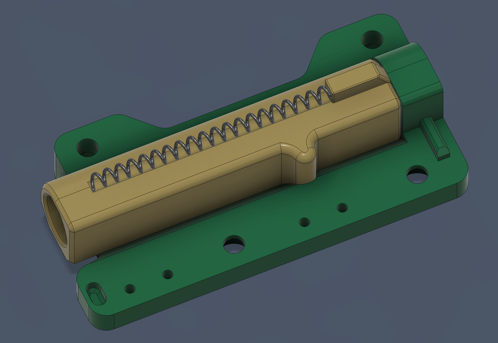

# HydroBuffer
A Klipper based buffer to feed, unload and synchronize filament delivery to the toolhead  

The buffer consists of four parts:  
+ The housing (designed by me)  
+ Springloaded Turtle Neck, origninally modified by jakepfake, then modified by me for the buffer  
+ [Dual-Sensor WWBMG by DWTAS](https://github.com/Armchair-Heavy-Industries/A4T/tree/main/STL/WW-BMG%20for%20A4T/Dual%20Sensor)
+ A macro of some sort

*BOM*  
|Thing|Quantity|Notes|
|---|---|---|
|ECAS04|2|Need another for WWBMG, but follow that BOM|  
|Omron df2-l|2| Need another 2 for WWBMG, but follow that BOM|
|M3 heatsets|5| |
|M3 Square nuts|2|Need another 1 for WWBM, but follow that BOM|
|M2x10 self tapping screws|4|need another 4 for WWBMG, but follow that BOM|
|2.5mm ID PTFE|Enough||
|26awg wiring|enough| |
|M3 fasteners|enough|
|NOZZLE RESET SPRING|1|[found here](https://www.redwolfairsoft.com/accessories-springs-spring-guides-gbb-guns-modify-125-nozzle-reset-spring-for-tokyo-marui-g-series-2pcs-set.html) but other springs may work|

*Assembly*  

To assemble, it's pretty straight forward.  
1) Build WWBMG, per the instructions posted in that repo  
2) Build the TN per the instructions [here](https://www.armoredturtle.xyz/manual.html?manual=turtleneck&step=1). Leave the wiring long, and put the spring in place like the image below
3) Install the M3 heatset and 2x M3 square nuts  
4) Install the TN into the housing; use 4x M3 fasteners through the bottom of the housing
5) Install a length of 2.5mm ID PTFE tube through the housing, into the TN. Hold the TN plunger fully compressed,
slide in the PTFE until it stops, then cut the PTFE to be SLIGHTLY proud of the housing  
6) Install the WWBMG and route the wiring along the side of the houseing, above the TN switch wiring
7) Install the lid by pulling the wiring through the opening, and attaching the lid to the housing using a
   M3x8 SHCS on the end of the lid, and an M3x6 BHCS on the top

